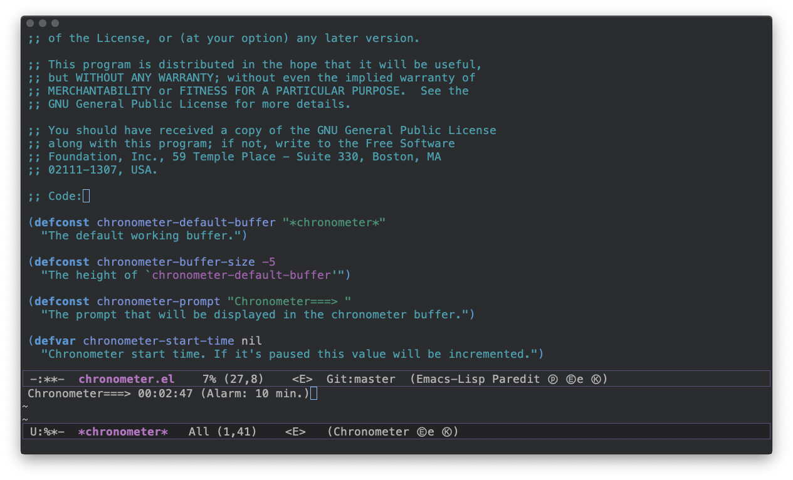

# chronometer

**A Chronometer for GNU Emacs**

This is a major mode to help you keep track of time. 

I've created it because I used to cook pizza while coding and regularly
completely forget about it. Yes, the result a few minutes later was a burned
pizza that went straight to trash.

It is a major mode that opens in a very discrete buffer, you can set an alarm to
whenever you want and you will be alerted accordingly. For your convinience you
can hide it to concentrate and you'll still be alerted.

## How to Install

### Using MELPA

Easiest way to install is through MELPA:

1. M-x package-refresh-contents RET
2. M-x package-install RET
3. Write Chronometer and hit enter

### Manually

1. Clone the repo in your machine
2. Load the file using  `(load-file "~/location/chronometer.el")`

## How to use it

After installing:

`M-x chronometer-mode`

It will automaticaly start from zero and increment every one second.

### Available commands

| Key   | Description         |
| ----- | -----               |
| a     | Set Alarm           |
| s     | Stop Alarm          |
| p     | Pause Chronometer   |
| r     | Restart chronometer |
| h     | Hide                |
| q     | Quit                |
| ?     | Help                |

If you hide the buffer and want to come back just call `M-x chronometer-mode` again.
